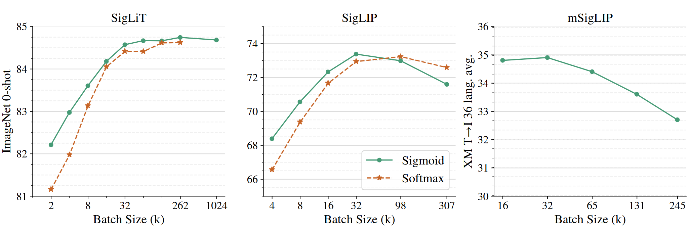
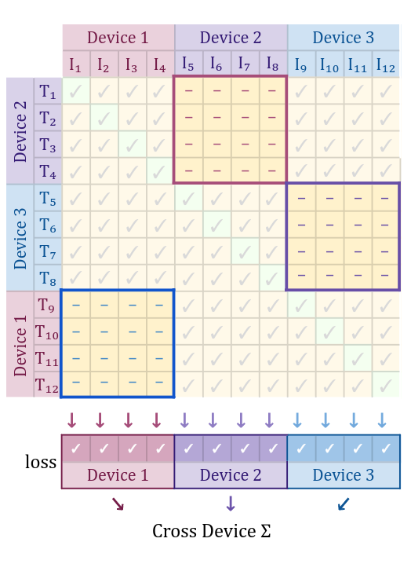

# Approach
This implementation is heavily based on the [SigLIP model](https://arxiv.org/abs/2303.15343) from Google AI.
**SigLIP** is an model similar to **CLIP**, but based on the idea of using a sigmoid contrastive loss instead of a cross-entropy one.

The results from the original paper suggested **SigLIP** is much easier to train and scale than **CLIP**, which might come in handy when fine-tuning the model.

# Data
Conversion data is split temporally to reproduce a "real scenario" recommendation where we only have data from the past, not the future.

For extra details and analysis about the data and its analysis, please refer to the notebook **[2.-analysis.ipynb](../notebooks/2.-analysis.ipynb)**.

# Metrics
Since we are working on a problem where most users don't re-appear often, each query is framed so it generates a single conversion.

This means we can simplify the evaluation problem, so we only have to take into consideration two factors:
- **Hit Rate**  
  Metric that signals whether the recommended item was recommended to the user in the top `k` positions.
- **Mean Average Precision**  
  Used to evaluate the effectiveness of a search algorithm or system. It takes into consideration the ranking position of the recommended item.

# Results
During the training we've explored three different solutions:

**Zero-shot**  
Can we achieve reasonable performance using a default `google/siglip-base-patch16-224` model?

|   k |   hit_rate |   mAP |
|----:|-----------:|------:|
|   1 |      0.037 | 0.037 |
|   5 |      0.121 | 0.066 |
|  10 |      0.168 | 0.072 |
|  25 |      0.260 | 0.078 |

The results using this method are not great. They're specially bad when we consider that the hit rate @ 1 is only 3.7%, whichs is pretty bad when we consider that a search engine should strive to suggest relevant items on top.

**Fine-tuned SigLIP**

We fine-tune the original model on `conversion` data to ensure the model is capable of suggesting relevant items on each query.

|   k |   hit_rate |   mAP |
|----:|-----------:|------:|
|   1 |      0.144 | 0.144 |
|   5 |      0.348 | 0.218 |
|  10 |      0.463 | 0.233 |
|  25 |      0.602 | 0.242 |

The results are much better than the vanilla approach, with metrics improving 300-500%.

With a simple fine-tuning, we're able to yield correct suggestions in the top 5 images almost 35% of the time.

**Fine-tuned SigLIP + Country + Keywords**

Aside from fine-tuning, this approach includes two improvements over the original model:
- *Country*

    We modify the original model to add the country as a token of the original query. For example, someone looking for a cat photo in the UK would be codified as `UK: cat` in by the query encoder.  
    The reasoning is that the same query might mean something slightly different for each country, but there will also be a lot of overlap (i.e. someone from Spain might search for a term in English), while this approach allows us to keep a **single model** for every country with **no architectural changes**.

- *Image Keywords*

    We add the additional keywords to each one of the images and codify them using an ID encoder. This avoids the problem of adding many tags per image (sometimes in the 100s), while keeping the architectural design quite simple.

|   k |   hit_rate |   mAP |
|----:|-----------:|------:|
|   1 |      0.148 | 0.148 |
|   5 |      0.363 | 0.224 |
|  10 |      0.476 | 0.239 |
|  25 |      0.616 | 0.248 |

This approach results in **slightly better** metrics than the original one, but not much. Probably because the information on the tags is already contained in the image itself.

(Note: An ablation study would be required to separate the effects of the *country* and the *keywords*)

# Future Improvements
- **Bigger batch size:**  
Due to the limitations of my personal machine, the maximum batch size used was 128. Since models like SigLIP work in a _"somewhat"_ contrastive approach, it benefits the most from having more in-batch negatives. In order to do so, we could split the computation of the loss matrix into different GPU -or even a single one running on a for loop-.

- **Reranking:**  
It is possible that a simple contrastive model is not enought to generate the best recommendations. It is common practive to use a (usually more complex) **reranking model** to further improve over the recommendations of the original one.

- **Mask co-occurring images in batch**  
Since we're sampling temporally from the conversions dataset, it is possible that the same appears more than once in the batch of data, with the effect being bigger with bigger batch sizes. This might lead to false negatives in the training set that reduce the final performance of the model.
To avoid this, we should use a masking mechanism so that the loss is ignored in these cases.

- **Add extra features**  
The current model is based mostly on the user query+country, and the image+keywords. We might consider adding additional information such as the photo description, popularity (by number of downloads), recency...
